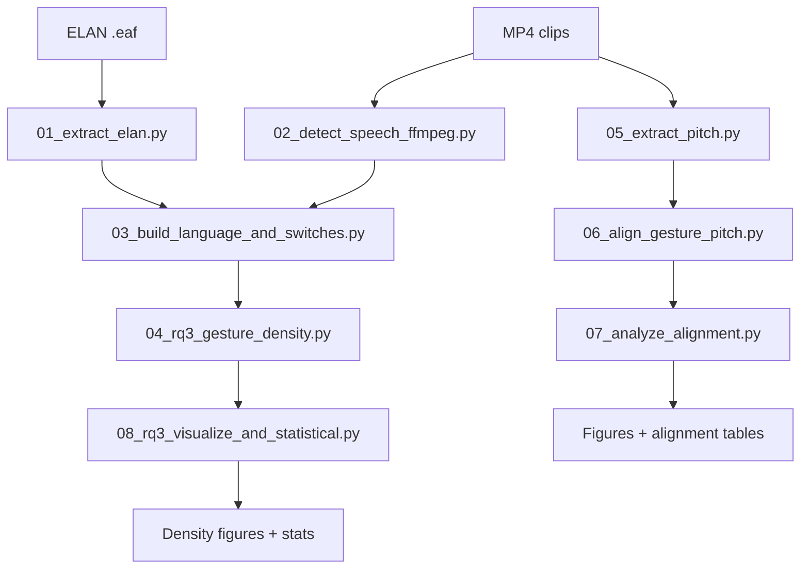

## Pipeline overview

This project follows an end to end multimodal pipeline:

1. Extract ELAN annotations (gesture strokes, English intervals)
2. Detect speech segments from audio (FFmpeg)
3. Build switch points and ±500 ms switch windows
4. Compute gesture density inside vs outside switch windows
5. Extract pitch contours and pitch peaks (Praat)
6. Align gesture stroke onsets to nearest pitch peaks
7. Summarise alignment and generate figures
8. Run paired statistics for density comparisons

A Mermaid diagram is included below for easy rendering on GitHub.

